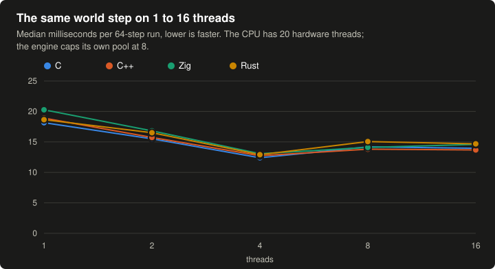

# bench

C, C++, Zig and Rust running the same twenty-seven kernels from a voxel physics
engine. Every kernel produces a checksum, and the runner only reports when all
four languages produce the same bits.

## Results

Intel Core i5-14600K, Arch Linux (kernel 7.2.6), clang 22.1.8, Zig 0.16.0,
rustc 1.98.1. Five interleaved rounds of five repetitions. Median milliseconds
per repetition, and the median relative to the fastest language for that
kernel.


The average leaves out `sort`: it times each standard library's sorting algorithm (`qsort`, introsort, pattern-defeating quicksort), not the compiled code, and its 4x to 8x gaps would swamp everything else.


The same numbers as a table:

| kernel     |     C |   C++ |   Zig |  Rust |     C |   C++ |   Zig |  Rust |
|------------|------:|------:|------:|------:|------:|------:|------:|------:|
| dda        |  5.08 |  5.06 |  5.16 |  5.46 | 1.00x | 1.00x | 1.02x | 1.08x |
| flood      | 16.05 | 16.20 | 17.04 | 16.41 | 1.00x | 1.01x | 1.06x | 1.02x |
| surface    |  8.97 |  9.68 |  7.61 | 12.08 | 1.18x | 1.27x | 1.00x | 1.59x |
| mips       |  8.30 |  8.08 | 10.75 | 10.41 | 1.03x | 1.00x | 1.33x | 1.29x |
| mass       | 11.45 |  9.88 | 10.80 | 13.71 | 1.16x | 1.00x | 1.09x | 1.39x |
| sweep      |  7.83 |  7.39 |  7.24 |  6.39 | 1.23x | 1.16x | 1.13x | 1.00x |
| bvh        | 16.97 | 16.57 | 16.44 | 16.15 | 1.05x | 1.03x | 1.02x | 1.00x |
| islands    |  2.10 |  2.02 |  2.03 |  2.21 | 1.04x | 1.00x | 1.01x | 1.10x |
| colour     |  1.96 |  1.96 |  1.83 |  1.69 | 1.15x | 1.16x | 1.08x | 1.00x |
| solve      | 13.71 | 13.50 | 16.80 | 13.47 | 1.02x | 1.00x | 1.25x | 1.00x |
| integrate  | 10.11 |  8.63 |  6.60 | 10.03 | 1.53x | 1.31x | 1.00x | 1.52x |
| transform  | 11.94 | 11.96 |  9.78 | 11.35 | 1.22x | 1.22x | 1.00x | 1.16x |
| unproject  |  9.71 |  9.42 |  6.96 |  7.13 | 1.39x | 1.35x | 1.00x | 1.02x |
| decompose  |  9.44 |  9.13 |  7.36 |  7.15 | 1.32x | 1.28x | 1.03x | 1.00x |
| raycast    | 13.00 | 13.03 | 11.82 | 13.77 | 1.10x | 1.10x | 1.00x | 1.16x |
| boxbox     | 12.24 | 11.25 | 11.98 | 12.95 | 1.09x | 1.00x | 1.07x | 1.15x |
| wide       | 19.83 | 21.11 | 22.70 | 20.14 | 1.00x | 1.06x | 1.14x | 1.02x |
| broadphase | 22.76 | 23.35 | 22.48 | 21.31 | 1.07x | 1.10x | 1.05x | 1.00x |
| gas        | 26.24 | 25.92 | 29.24 | 21.52 | 1.22x | 1.20x | 1.36x | 1.00x |
| world      | 18.16 | 18.91 | 20.27 | 18.65 | 1.00x | 1.04x | 1.12x | 1.03x |
| world4     | 12.40 | 12.74 | 13.06 | 12.91 | 1.00x | 1.03x | 1.05x | 1.04x |
| particles  | 26.35 | 28.41 | 29.20 | 29.35 | 1.00x | 1.08x | 1.11x | 1.11x |
| json       | 21.94 | 23.79 | 17.94 | 20.14 | 1.22x | 1.33x | 1.00x | 1.12x |
| anim       | 19.99 | 21.29 | 20.20 | 19.18 | 1.04x | 1.11x | 1.05x | 1.00x |
| ui         | 14.71 | 20.10 | 12.78 | 14.96 | 1.15x | 1.57x | 1.00x | 1.17x |
| slotmap    | 24.52 | 23.76 | 25.26 | 23.72 | 1.03x | 1.00x | 1.06x | 1.00x |
| chunkmap   | 26.09 | 26.33 | 26.33 | 26.63 | 1.00x | 1.01x | 1.01x | 1.02x |
| sort       | 41.21 | 22.20 | 36.30 |  5.27 | 7.82x | 4.21x | 6.89x | 1.00x |

Raw samples and best-of-run numbers: [results/latest.md](results/latest.md).

## Kernels

| kernel    | work                                                                                    |
|-----------|-----------------------------------------------------------------------------------------|
| dda       | 100k rays walked cell by cell through a 128^3 occupancy bitset                          |
| flood     | 6-connected breadth-first labelling of a 128^3 grid at 30% fill                          |
| surface   | exposed-face count of every solid voxel in a 128^3 grid at 75% fill                      |
| mips      | rebuild row bitsets and 4^3 mips for 512 chunks of 32^3, then popcount                    |
| mass      | mass, centre of mass and inertia tensor of 128 bodies of 32^3 voxels                     |
| sweep     | sort-and-sweep broadphase over 16384 boxes, using the standard library sort              |
| bvh       | build a BVH over 16384 boxes, then trace 20k rays through it                              |
| islands   | union-find over 524288 contacts between 65536 bodies, label by lowest slot               |
| colour    | greedy graph colouring of 524288 contacts so each colour solves in parallel              |
| solve     | 8 frames of substepped sequential impulses, 4096 bodies, 16384 contacts                  |
| integrate | 32 steps of position, velocity and quaternion integration over 65536 bodies              |
| transform | 8 frames of scene-graph propagation over 65536 nodes: rotate, compose, model-view-projection |
| unproject | look-at, perspective, 4x4 cofactor inverse and four unprojected points for 131072 cameras  |
| decompose | basis from rotation and scale, then scale, rotation, inverse and rotate back, 262144 times  |
| raycast   | closest hit of 1024 rays against 1024 oriented boxes with the engine's slab test          |
| boxbox    | 8 frames of box-box SAT, face clipping, reduction and warm starting over 8192 pairs        |
| wide      | 4 steps of the engine's 8-lane contact solver: 8192 stacked bodies, 12k coloured contacts  |
| broadphase | 16 frames of 4096 tumbling boxes through the engine's dynamic AABB tree and pair map     |
| gas       | 4 substeps of the engine's particle gas solver over 8192 particles and 4 stirring boxes    |
| world     | 64 steps of the engine's `PhysicsWorld::step` on one thread: 900 boxes settle, sleep, wake  |
| world4    | the same 64 steps on the engine's task pool with 4 threads                                  |
| particles | the engine's particle emitter step: 12 emitters of 2048 particles, 6 substeps, curves, collision, sub emitters |
| json      | the engine's JSON reader parsing a 5.9 MB scene document into a DOM, then walking it like the entity loader |
| anim      | the engine's animation players: 1024 players, 3 clips of 8 tracks and 48 keys, blends, capture, root motion, string-keyed accumulators |
| ui        | the engine's UI: layout and draw list of a tree of about 20 thousand controls behind virtual calls and string-keyed themes |
| slotmap   | 4M insert, remove and lookup operations on a 65536-slot generational slot map           |
| chunkmap  | open-addressing hash map: 200k inserts, 2M lookups at 50% hit rate                        |
| sort      | `qsort`, `std::sort`, `std.mem.sortUnstable` and `sort_unstable` over 2^19 random u64 keys |

Kernels allocate before the timed region, except where the engine itself
allocates: `broadphase`, `world` and `world4` rebuild their world inside each
repetition and grow lists as the engine does. `transform` through `boxbox`
port the engine's `math.cpp`, `ray_cast.cpp` and `box_collision.cpp` into a
shared `vecmath` module per language.

`wide` ports `contact_solver.cpp`, `simd.hpp` and the constraint graph's
colouring, single-threaded: each step prepares scalar constraints, packs every
colour into eight-lane bundles, runs 4 substeps of warm start, biased solve,
position integration and relaxed solve with friction, then restitution, and
stores impulses and poses. Each language writes the SIMD the way a port would:
C++ keeps the engine's vector-extension `FloatW8`, C uses AVX intrinsics, Zig
uses `@Vector(8, f32)`, and Rust wraps `core::arch` AVX intrinsics in its own
`F8` type with `unsafe` inside, because `std::simd` is still nightly-only.

`broadphase` ports `aabb_tree.cpp` and `broad_phase.cpp`: each frame refits
the fat bounds that no longer hold, reinserts those leaves with the tree's
rotations, queries the moved proxies against the dynamic and static trees,
records new pairs in a hash map keyed by shape pair, and drops pairs whose fat
bounds parted. `gas` ports the particle system's gas solver: a sorted spatial
hash searched with `lower_bound` for pressure and viscosity, and moving boxes
that stir and push particles.

`world` through `world16` run the engine's whole fixed step for bodies of one box:
body changes and waking, proxy refits, pair finding, box collision with
contact recycling, contacts beginning and ending touching with island linking,
merging and graph colouring, the eight-lane solver, and the sleep pass that
splits islands and puts resting ones to sleep. 144 piles of six boxes settle
and fall asleep; 36 tumbling boxes land on sleeping piles and wake them; a
shove at step 45 wakes every eighth pile. Every thread count must produce the same
bits as `world`. Each language ports the engine's spinning task pool rather than
reaching for a library, and uses its standard hash map for the contact index:
`std::unordered_map`, `std.AutoHashMap`, `rustc_hash::FxHashMap` (Rust's
default SipHash map is built to resist hash flooding, not for speed), and a
hand-written open-addressing map in C. Where the engine writes shared state
from several threads under an invariant the compiler cannot check (colours
touch disjoint bodies, collide blocks own disjoint contacts), Rust needs
`unsafe`.

`particles`, `anim` and `ui` are the engine's per-frame CPU work outside
physics, and `json` is its load path. They stay trig-free like the others, so
each replaces the engine's `sin`, `cos`, `exp`, `pow` and `fmod` with exact
`+ - * /` equivalents, and says so in its header comment:

- `particles`: Taylor polynomials for the spread cone and hue rotation,
  `k / (1 + k)` for the wind response, `i * s` for the turbulence blend, only
  point and box emission shapes, a ground slab and six boxes as the collider,
  world space only, six fixed substeps.
- `anim`: normalised lerp instead of slerp, polynomial sine and exponential
  eases, `x - floor(x / len) * len` for `fmod`. Clips live in a vector, names
  are string views, and the accumulator lookup stays a linear scan comparing
  target strings, as in the engine.
- `json`: the whole token must parse as a number (the engine's `std::stod`
  accepts a valid prefix), numbers parse with each language's correctly
  rounded routine, and the generated document is written with integer
  arithmetic only so all four languages produce the same bytes. C++ is built
  without exceptions, so its parser reports failure by return value.
- `ui`: a fake font with fixed advances instead of stb_truetype; the tree is
  real pointers behind virtual calls (C++ virtuals, C function-pointer tables,
  Zig vtable structs, Rust trait objects).

## More than speed

### Threads

`world` through `world16` are the same step on a pool of 1, 2, 4, 8 and 16
threads. All four languages scale the same way and the lines overlap: 4
threads are fastest, and 8 and 16 are slower. The step has only 900 bodies and
synchronises after every colour of the solver, so the extra threads probably
spend more time waiting than working. The engine caps its pool at 8 threads.



### Safe Rust

The Rust solver and task pool use `unsafe` where the engine writes shared
state under an invariant the compiler cannot check. `world4safe` is the same
step with none: a rayon pool, body state held in relaxed atomics, bundles and
contacts split with `par_chunks_mut` and `split_at_mut`, and each destination
pulling its result instead of the solver scattering it. It produces the same
bits as `world4`.

| | median ms |
|---|---:|
| `world4`, with `unsafe` | 12.9 |
| `world4safe`, no `unsafe` | 15.2 |

Staying safe costs about 18% here. The lane maths in `world4safe` is plain
`[f32; 8]` arrays that the compiler vectorises; swapping the intrinsic wrapper
back in made no measurable difference.

### Build times

`python buildtime.py` builds copies of the sources; the numbers are in
[results/build-times.md](results/build-times.md). C compiles every file on its
own, and so does C++, but the C++ headers are heavier. Zig and Rust always
rebuild the whole program, so one edited file costs about as much as a clean
build; Rust's default release profile (no LTO, 16 codegen units) builds in a
third of the time and `cargo check` after an edit takes half a second. The
benchmark's profile (fat LTO, one codegen unit) is the slow one.

| seconds | C | C++ | Zig | Rust |
|---|---:|---:|---:|---:|
| clean | 3.8 | 19 | 21 | 11 |
| clean -j | 0.5 | 2.9 | n/a | n/a |
| one file | 0.3 | 1.5 | 20 | 9.1 |
| one header | 0.5 | 1.9 | 21 | 9.0 |

The `-j` row compiles C and C++ files in parallel on all 20 hardware threads
(Zig and Rust have no such row, their compilers parallelise internally). The math header is included by 26 of 50 C files and 21 of 45 C++ files.

### Memory

`python memory.py` runs each kernel alone and reads its peak resident set size
([results/memory.md](results/memory.md)). The four languages land within a few
percent of each other on almost every kernel, since the state is the same
arrays. The exceptions are `json` (C++ 39 MiB against about 25 in the others),
`ui` (C and C++ about 19 MiB, Zig and Rust about 13), `world16` (Zig 10 MiB
against about 2, probably the stacks of its sixteen threads) and `flood`
(C++ 18 MiB against 10 to 12). I did not dig into why.

## Rules

- clang, Zig and rustc all lower through LLVM.
- `-O3 -march=native -ffp-contract=off` for C and C++; `ReleaseFast` on the native CPU for Zig; `opt-level = 3`, fat LTO, one codegen unit and `-C target-cpu=native` for Rust.
- Operations are written in the same order in all four sources.
- Rust keeps its bounds checks and its overflow semantics; that is what idiomatic means here.
- SIMD min and max are selects (`a > b ? a : b`), which is exactly what MAXPS and MINPS compute, so every lane rounds the same in every language.
- Only `+ - * /`, `sqrt` and `floor` touch floats: `sin`, `acos`, `tan`, `exp` and `pow` differ in the last bit between glibc and Zig's own libm, so the kernels that need them use exact equivalents (listed above) and `perspective` takes the tangent precomputed.
- Floats are folded into the checksum by bit pattern. A mismatch across languages or repetitions aborts the run.
- Each round rotates which executable runs first.
- Idiomatic code in each language, no hand tuning.

## Running

Requires clang and clang++, Zig 0.16, a stable Rust toolchain, GNU make and
Python 3.10+.

```
make                # build out/bench_{c,cpp,zig,rust}
make run            # build, then python run.py
python run.py --rounds 10 --reps 5
python run.py --langs c zig --no-build
python memory.py    # peak memory of every kernel, results/memory.md
python buildtime.py # compile times, results/build-times.md (run on an idle machine)
python chart.py     # redraw results/*.svg from results/latest.json
```

`make ZIG=/path/to/zig CC=clang-20 CXX=clang++-20 CARGO=cargo` overrides the
toolchains.

Each executable takes `[reps] [warmup] [kernel...]`, runs the named kernels or
all of them, and prints one line per kernel:

```
name min_ns median_ns checksum_hex
```

## Layout

```
c/src/      one .c and .h per kernel and per engine module; hash, clock, alloc, vecmath and harness shared
cpp/src/    one .cpp and .hpp per kernel and per engine module; hash, clock, vecmath, simd and harness shared
zig/src/    one .zig per kernel and per engine module; hash, vecmath and harness shared; build.zig alongside
rust/src/   one .rs per kernel and per engine module; hash, vecmath, simd and harness shared; Cargo.toml alongside
run.py      builds, interleaves, verifies checksums, writes results/
chart.py    draws results/*.svg from results/latest.json
memory.py   peak resident memory of every kernel in every language
buildtime.py compile times of every language on a copy of the sources
Makefile    the build flags
results/    the last run
```
